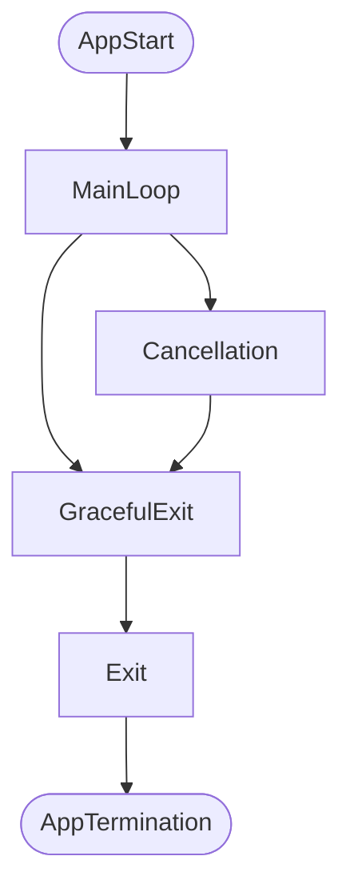

# ConsolePOC.ScheduledTask  
**Author:** John L. Cruz Jr.

## Overview

A simple framework/boiler plate code that is used to build a "Windows Task Scheduler" task/service.


### App lifecycle



## How to use:

Instantiated a new `Runner` class and call `.Run()` while passing the entry point to your process. Run on the top level of the app.


### Example usage
Util.cs
```csharp
public static void SomeAction() => thread.sleep(2000)
```
Main.cs
```csharp
Runner runner = new Runner()
runner.Run( () => { SomeAction(); } )
```

## Extending Functionality of the Runner

Additionality, we can extend the functionality and create a derive class to override the `CustomGracefulShutdown`, `CustomCancellation`, and `CustomExit` methods. These additional controls are tide to the apps lifecycles.

## Overview
The `Runner` is a manager for the task that are scheduled to run with the Windows Task Scheduler. It is a base class that contains basic functionality can be extended.

### Constructor
- **`Runner()`**
  - **Description:** Initializes class.

### Properties
- **`bool TaskComplete`**
  - **Get** whether or not the inserted action ran by the runner has completed successfully.
  - On instantiation is **false**

- **`bool TaskInterrupted`**
  - **Get** whether or not the inserted action ran by the runner was interrupted.
  - On instantiation is **false**

- **`bool HasGracefullyExited`**
  - **Get** whether or not the inserted action ran by the runner has shutdown in a graceful manor successfully.
  - On instantiation is **false**
	
### Methods

#### Concrete
- **`Void Run(Action insertedAction, Action? finalAction = null)`**
    - **Description:** Safely executes the passed in action and logs the start of the execution.
    - **Parameter:** 
      - `Action insertedAction` - A passed in action to be executed and managed by the runner class.
      - `Action? finalAction = null ` - An optional Action that will execute in the ``final`` block of the main `try` `catch`.
- **`Void InvokeCancellation()`**
  - **Description:** Programmatically invoke the cancellation sequence. Fire off termination signal to console app. Equivalent to `ctr+c` or `ctr+break`.

#### Virtual
- **`Virtual Void CustomGracefulShutdown()`**
    - **Description:** The graceful shutdown sequence acts as a safe guard to dispose, or log any resources that are need. The CustomGracefulShutdown when overridden provides an additional mechanism to log, dispose, capture data, or start other actions. Runs at on task complete or when the task is interrupted by a termination signal. Always runs. 
- **`Virtual Void CustomCancellation()`**
    - **Description:**  The cancellation method or sequence is call when the app detects the termination 
- **`Virtual Void CustomExit()`**
    - **Description:** The Exit sequence terminal to all process. The CustomGracefulShutdown when overridden provides an additional mechanism to log, dispose, capture data, or start other actions. Always runs and isa last line defense for actions or items. Items here must be as atomic as possible and must stable. **Exercise caution** when overriding as volatile actions/item will have dire consequences to overall app integrity. Move volatile action to GracefulShutdown sequence.  Always runs.


## Remarks

With in the Windows Task Scheduler, there is no way to view whether or not the task actually ran correctly. Although the history tab appears to be a way to determine whether it did it is miss leading. What it actually records/displays is whether the task scheduler it self was able to run the app. I.e. it would fail if the task scheduler has insufficient permissions to the app or wasn't able to locate the app in the location specified when creating the task. This is further confirm by looking at the history tab and looking at the source column which all say task scheduler and not the app that we manually registered.

This is where the windows event viewer comes into play. With the registration we can can see, once we add the app as a task and schedule a run, that the app is printing the event view. Depending how the app is written  we and further amplify or dilute the amount of logs we see.

Additionally if the app where to crash, unhandled exception, the Common Language Runtime (CLR) creates an event, a default behavior. There is a mechanism in the CLR to provide this log in the event viewer even with logging configurations with in the app. This is severely limited to unhandled exceptions though and even then we are unable to distinguish traits with in the clr events and what app crash. the event describes a problem with the clr and only by reading the description of the event are able to determine what app crash. This isn't ideal as you cannot trigger any additional events to the the App it self. is you were to try and schedule a task base on this crash it event it would fire off every time a app crash the clr even if it is unrelated.

### Additional Remarks: Event Viewer
If using the event viewer for logging prior to the installation the app must be registered, use the following command. 

	New-EventLog -LogName Application -Source "ConsolePOC.ScheduledTask"

Creates a record in the registry. Required, will cause a error in the event viewer.

#### Source
  https://github.com/NLog/NLog/wiki/EventLog-target#notes

### To-Do
- [ ] Runner class has dependency in the NLog for logging. Need to be rewritten with DI to fix.

- [ ] Fix Constructor documentation.

- [ ] Rename the project to ..?..